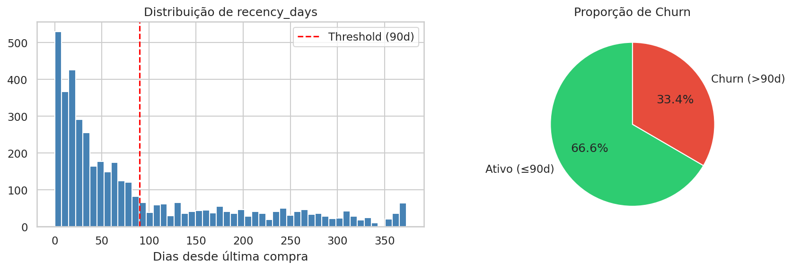
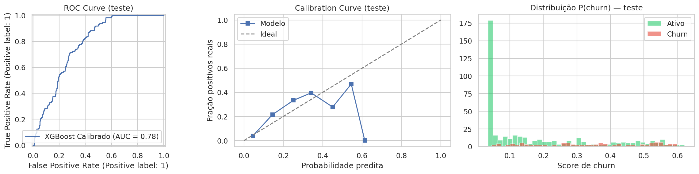
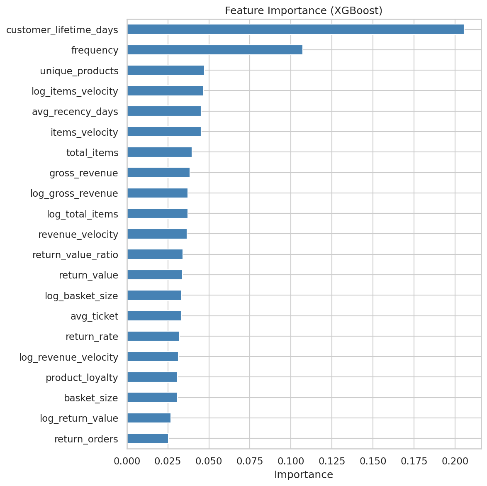
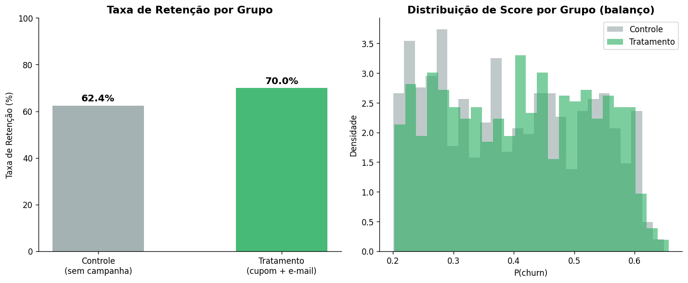
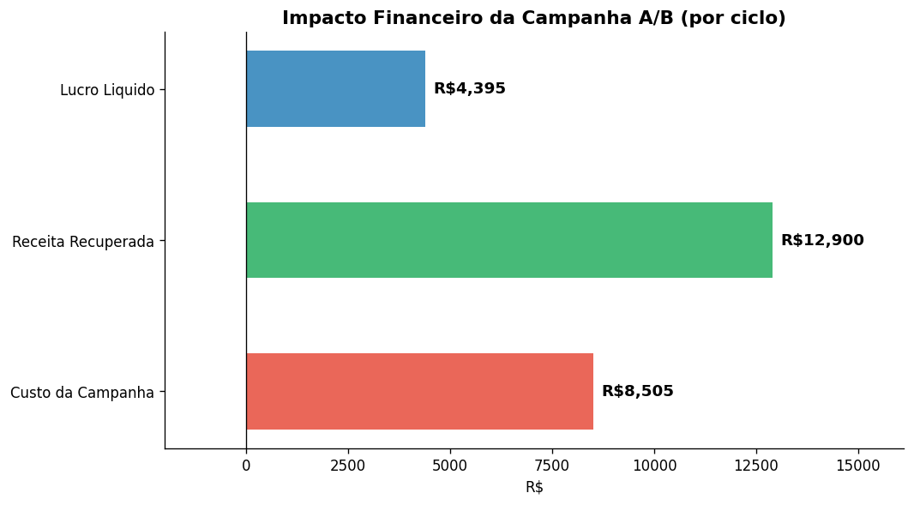
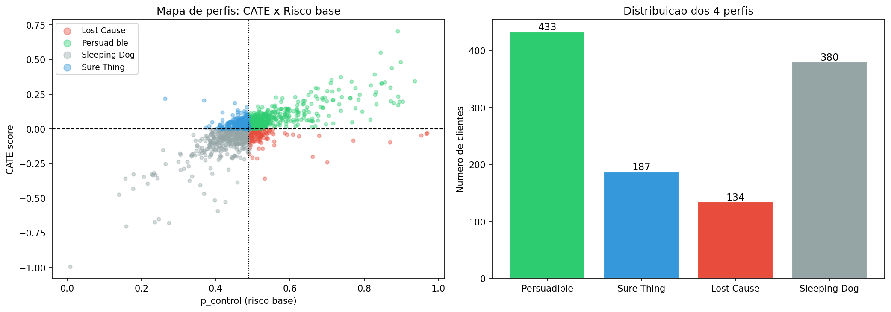
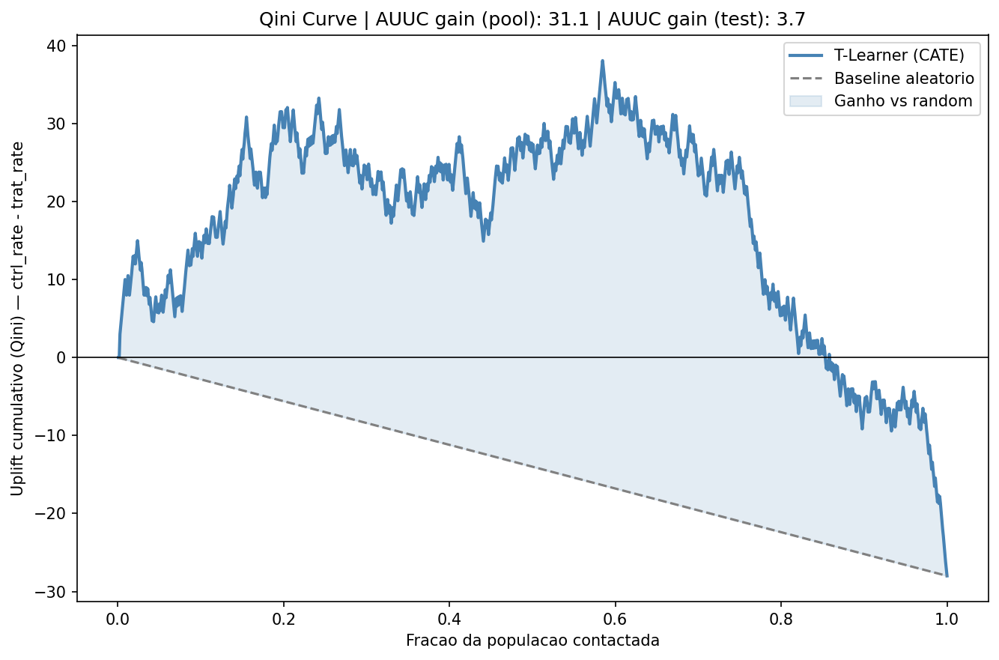
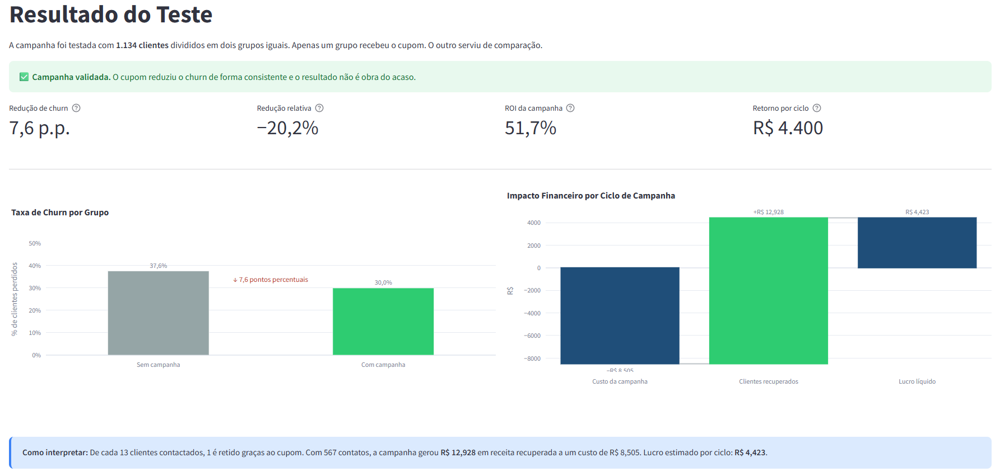
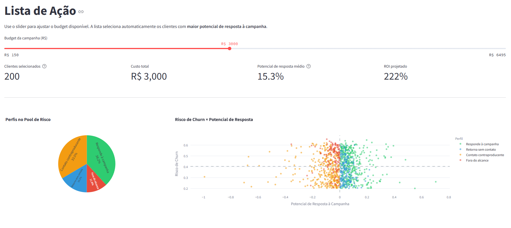
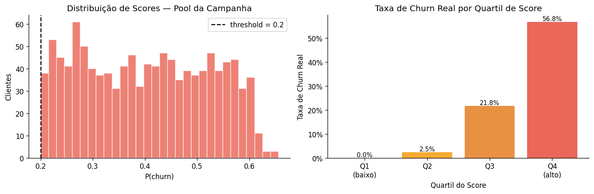

# Churn Prediction + A/B Testing + Uplift Modeling — End-to-End Retention Science

> Pipeline de 3 camadas que identifica clientes em risco de churn, valida uma campanha de retenção com rigor estatístico e descobre para quais clientes a intervenção realmente muda o comportamento.

---

## 🎯 Problema de Negócio

Um e-commerce B2C com 4.300 clientes e ticket médio de R$ 350 tem um problema de retenção: clientes sem compra há 90 dias raramente retornam espontaneamente, e o custo de reativação cresce com o tempo.

O time de CRM dispõe de um budget fixo para campanhas (cupom 10% + e-mail, R$ 15 por contato). Contatar toda a base em risco esgota o budget e dilui o impacto. Sem um modelo, duas situações custam dinheiro:

- **Falso negativo:** cliente churn não contactado → perda da receita (~R$ 350)
- **Falso positivo:** cliente que ficaria de qualquer forma recebe cupom → custo sem retorno (R$ 15)

A relação FN/FP é de **7×**, o que exige threshold conservador e um método para separar quem responde à intervenção de quem retornaria mesmo sem ela.

---

## 📌 Objetivos de Negócio

| Objetivo | Entregável |
|----------|-----------|
| Identificar clientes em risco nos próximos 90 dias | Score P(churn) por cliente + threshold operacional |
| Validar se a campanha gera lift estatisticamente significativo | Teste A/B com χ², IC95% e impacto financeiro |
| Descobrir quem realmente muda de comportamento | Segmentação em 4 perfis via T-Learner (CATE individual) |
| Pipeline operacional sem dependência de banco de dados | `score_campaign.py`, saída pronta para CRM em CSV |

**Critério de sucesso:** ROI positivo com lift estatisticamente significativo (p < 0,05).

**Premissas da campanha:**

| Parâmetro | Valor |
|-----------|-------|
| Custo por contato | R$ 15 |
| Desconto do cupom | 10% |
| Taxa de retenção estimada (benchmark e-mail/cupom) | 30% |
| Ticket médio | R$ 350 |
| Retorno líquido por churner retido | R$ 90 |

---

## 🧩 Metodologia — CRISP-DS

1. **Entendimento de negócio:** definição do churn (90 dias), custo de FN vs. FP, estrutura da campanha
2. **Extração de dados:** `customer_segments.parquet` derivado do PA005 (RDS PostgreSQL)
3. **EDA:** 4.299 clientes, 21 features, identificação de paradoxos e outliers
4. **Limpeza e filtro:** remoção de one-time buyers; dataset de modelagem: 2.758 clientes
5. **Feature engineering:** log transforms, remoção de leakage, 21 features finais
6. **Camada 1 (Churn Model):** XGBoost + Optuna (50 trials) + CalibratedClassifierCV (sigmoid); threshold 0,20
7. **Camada 2 (A/B Testing):** design estatístico, simulação de campanha, teste qui-quadrado
8. **Camada 3 (Uplift Modeling):** T-Learner com Logistic Regression; CATE individual; 4 perfis; Qini curve
9. **Scoring pipeline:** `score_campaign.py` end-to-end; parquet + CSV com top Persuadibles

---

## 📦 Dados e Preparação

**Fonte:** `customer_segments.parquet`, exportação do PA005 (Customer Value Segmentation). 4.299 clientes, sem missing values, sem duplicatas.

**Filtro da população de modelagem:** `frequency >= 2 AND customer_lifetime_days > 0`

848 one-time buyers (problema de ativação, não retenção) e 51 quasi-one-time buyers (2 compras no mesmo dia) foram removidos. O churn rate passou de 33,4% para 20,3%, refletindo clientes com relação temporal real com a marca.

| Dimensão | Valor |
|----------|-------|
| Dataset de modelagem | 2.758 clientes |
| Churn rate (modelagem) | 20,3% (559 churned) |
| Features após leakage removal | 21 |

**Leakage removido:** `recency_days` (define o target), `cluster_*` (leakage indireto), `net_revenue` (multicolinear com `gross_revenue`, r > 0,99).

---

## ⚙️ Feature Engineering

**21 features finais:** 15 comportamentais (frequência, ticket, receita, devoluções, lifetime) + 6 log transforms para distribuições assimétricas (`log_gross_revenue`, `log_total_items`, `log_revenue_velocity` e derivadas).

> `customer_lifetime_days` tornou-se a feature mais discriminante após o filtro: com one-time buyers removidos, ela passa a carregar sinal preditivo real em vez de ser um artefato.

---

## 🔍 Análise Exploratória

O perfil dominante do churned: frequência mediana 1 vs. 3 para ativos, receita mediana R$314 vs. R$897 (−65%). Exploração completa em `notebooks/01_eda_churn.ipynb`.

**Paradoxo da `revenue_velocity`:** mediana dos churned (108,78) era ~10× maior que a dos ativos (10,77), artefato de one-time buyers com `lifetime = 0`, onde `revenue_velocity = gross_revenue / max(1, 0)`. Após o filtro, o paradoxo some: churned 6,77 vs. ativo 7,48.



---

## 🤖 Modelagem

### Camada 1 — Churn Prediction

| Modelo | ROC-AUC CV (treino) | ROC-AUC (teste) | Gap |
|--------|--------------------|-----------------|----|
| XGBoost baseline (sem tuning) | 0,784 | — | — |
| **XGBoost + Optuna + Sigmoid (final)** | **0,822** | **0,776** | **0,046** |

**Optuna (50 trials)** encontrou regularização pesada (`reg_alpha=1,99`, `reg_lambda=4,64`). **CalibratedClassifierCV sigmoid** substituiu isotonic: isotonic gerava plateaus de score no top-10 (score idêntico 0,824), tornando o ranqueamento inoperável. **Threshold 0,20** escolhido pela relação FN/FP = 7×: recall 74%, precision 37%, pool de 1.134 clientes.

| Cutoff | Precision | Recall |
|--------|-----------|--------|
| Top 50 | 46,0% | 20,5% |
| Top 100 | 38,0% | 33,9% |
| Top 200 | 39,0% | 69,6% |





---

### Camada 2 — A/B Testing

> **Nota sobre a simulação:** os outcomes de campanha foram gerados probabilisticamente: o churn do grupo tratamento é amostrado com P(churn) reduzida pelo lift de 30% (benchmark para campanhas de e-mail/cupom em e-commerce). O experimento valida o **design estatístico** e o **poder amostral**; o lift real deve ser medido em produção com dados observados. Para validação real: monitorar a taxa de recompra dos dois grupos por 90 dias em uma campanha ao vivo, usando retorno ao site ou nova compra como KPI primário. O tamanho de amostra calculado (157/grupo) garante poder suficiente para detectar o efeito esperado.

**Design:** 1.134 clientes com score ≥ 0,20, divididos aleatoriamente em 567 controle / 567 tratamento. Balanceamento verificado (teste t, p = 0,085).

| Grupo | Churn rate | Retenção |
|-------|-----------|---------|
| Controle (sem campanha) | 37,6% | 62,4% |
| Tratamento (cupom + e-mail) | 30,0% | 70,0% |

| Métrica | Valor |
|---------|-------|
| χ² | 6,96 (p = 0,008) |
| ARR | 7,6% (IC95% [2,1%, 13,1%]) |
| RR | 0,80 (NNT 13,2) |
| Lift relativo de churn | −20,2% |

**Impacto financeiro (por ciclo):** custo R$ 8.505 → 43 churners evitados → receita R$ 12.900 → **ROI 51,7%**





---

### Camada 3 — Uplift Modeling (T-Learner)

CATE = P(churn|controle) − P(churn|tratamento). Positivo = campanha reduz churn nesse cliente.

| Modelo | AUC Treino | AUC Teste | Gap |
|--------|-----------|----------|-----|
| Logistic Regression (Controle) | 0,624 | 0,565 | 0,059 |
| Logistic Regression (Tratamento) | 0,591 | 0,633 | −0,041 |

**4 perfis de uplift:**

| Perfil | n | CATE médio | Estratégia |
|--------|---|-----------|-----------|
| **Persuadible** | 433 | +0,092 | Alvo principal: campanha reduz churn em cliente de risco |
| Sure Thing | 187 | +0,045 | Retornaria mesmo sem campanha |
| Lost Cause | 134 | −0,050 | Não responde ao tratamento |
| Sleeping Dog | 380 | −0,106 | Campanha pode aumentar churn. **Não contatar** |

**AUUC gain:** +31,1 (pool inteiro) / **+3,68 (test-only, avaliação honesta)**. Com n=228 no test-only e `churn_real` como proxy histórico do outcome, qualquer valor positivo já indica que o modelo prioriza Persuadibles melhor que seleção aleatória em dados não vistos. Para amostras dessa ordem, ganhos acima de zero são o critério de sinal real, não magnitude absoluta.

**Top-200 Persuadibles:** CATE médio 0,153 → custo R$ 3.000 → lucro R$ 6.646 → **ROI 221,5%** vs. 51,7% no pool amplo.





---

## 📈 Resultados

| Camada | Entregável | Resultado |
|--------|-----------|---------|
| Churn Model | ROC-AUC | 0,776 (teste) / 0,822 (CV treino) |
| Churn Model | Threshold operacional | 0,20 (recall 74%, pool 1.134 clientes) |
| Churn Model | ROI estimado (ciclo) | R$ 26.640 (base: 2.758 clientes) |
| A/B Testing | p-value | 0,008 (significativo, α=5%) |
| A/B Testing | Lift | ARR 7,6%, IC95% [2,1%, 13,1%] |
| A/B Testing | ROI (pool amplo) | 51,7% |
| Uplift | Persuadibles identificados | 433 (38,2% do pool) |
| Uplift | AUUC gain (test-only) | +3,68 |
| Uplift | ROI (top-200 Persuadibles) | 221,5% |

---

## 📊 Dashboard Interativo

[](https://churnabupliftpipeline-s.streamlit.app/)

Painel operacional para o time de CRM, focado em decisão e ação.

| Página | Conteúdo |
|--------|----------|
| **Visão Geral** | KPIs de risco, distribuição de scores, como o modelo funciona |
| **Resultado do Teste** | Resultado do A/B, redução de churn, impacto financeiro por ciclo |
| **Lista de Ação** | Slider de budget → lista ranqueada de contatos + download Excel/CSV |





---

## ⚖️ Decisões Técnicas

**XGBoost → Logistic Regression no uplift**

O T-Learner original usou XGBoost nos dois grupos (~450 amostras/grupo). O gap de overfitting foi de 0,201–0,303, inviável para CATE individual. Substituído por Logistic Regression (C=0,5, `class_weight='balanced'`): gap final de 0,059 (controle) e −0,041 (tratamento), dentro do aceitável para esse tamanho de amostra.

**Sigmoid em vez de Isotonic para calibração do churn model**

`CalibratedClassifierCV(method='isotonic')` gerava plateaus de score: os top-10 clientes recebiam score idêntico (0,824), tornando o ranqueamento inoperável para priorizar contatos por budget. Sigmoid (Platt scaling) produz distribuição contínua preservando a ordinação.

**Threshold 0,20 em vez de 0,50**

O threshold padrão de 0,50 entrega precision 45%, recall 27%, descarta mais da metade dos churners reais. Com FN custando R$ 350 e FP R$ 15 (relação 7×), threshold 0,20 maximiza o ROI líquido: R$ 26.640 vs. R$ 20.925 no threshold 0,30.

**Filtro `frequency >= 2 AND lifetime > 0`**

Sem o filtro, o modelo aprendia que "clientes com uma compra churnam", trivialmente verdadeiro mas irrelevante para retenção. O filtro foca o modelo em clientes com histórico real de retorno, onde o sinal de churn é genuíno.

**CATE = control_rate − treatment_rate (não invertido)**

Na implementação inicial, a fórmula estava invertida. Corrigido para `u = control_rate − treatment_rate`: CATE positivo = campanha reduz churn = Persuadible.

---

## 💡 Principais Insights de Negócio

**One-time buyers dominam o churn mas não são o alvo de retenção**

Dos 1.436 clientes churned na base bruta, 848 (59%) nunca voltaram após a primeira compra, são um problema de **ativação**, não retenção. Misturar esses clientes contamina o sinal preditivo e infla o pool com clientes que nunca teriam respondido ao cupom.

**Sleeping Dogs: 380 clientes para não contatar**

33,5% do pool em risco tem CATE médio de −0,106: a campanha aumenta o risco de churn nesse segmento. Contatar essa faixa desperdiça R$ 5.700 em budget e pode acelerar o abandono. Identificá-los é tão valioso quanto encontrar os Persuadibles.

**ROI 4× maior ao focar vs. pulverizar**

Campanha no pool amplo (1.134 clientes): ROI 51,7%. Campanha nos top-200 Persuadibles: ROI 221,5%. A mesma receita recuperada com ~¼ do investimento.



---

## 🚀 Pipeline de Scoring em Produção

`scripts/score_campaign.py`: pipeline end-to-end sem dependência de RDS.

```
Entrada: data/raw/customer_segments.parquet
  ↓ feature engineering (build_features.py)
  ↓ churn model → P(churn) por cliente
  ↓ filtro por threshold → pool em risco
  ↓ uplift T-Learner → CATE + perfil por cliente
  ↓ ranqueamento por CATE
Saídas:
  data/processed/scoring_output.parquet  (pool completo — 1134×6)
  reports/campaign_targets.csv           (top-K Persuadibles com priority_rank)
```

```bash
python scripts/score_campaign.py
python scripts/score_campaign.py --top-k 300 --threshold 0.25
```

---

## ⚡ Como Rodar

**Dashboard interativo (sem instalação):**  
→ [churnabupliftpipeline-s.streamlit.app](https://churnabupliftpipeline-s.streamlit.app/)

**Localmente:**

```bash
# requer Python 3.10+
git clone https://github.com/polloncarlos/churn_ab_uplift_pipeline
cd churn_ab_uplift_pipeline
pip install -r requirements_dev.txt
```

> **Dado de entrada:** `data/raw/customer_segments.parquet`, exportado do PA005 (Customer Value Segmentation). Não está versionado; use o dashboard como referência ou entre em contato para acesso.

```bash
# Gerar scoring completo (churn + uplift)
python scripts/score_campaign.py

# Ajustar budget e threshold
python scripts/score_campaign.py --top-k 300 --threshold 0.25
```

---

## 🛠️ Stack Tecnológica


| Categoria | Tecnologias |
|-----------|-------------|
| Linguagem | Python 3.10 |
| Dados | pandas 2.2, numpy 1.26, pyarrow 16 |
| Machine Learning | scikit-learn 1.6, XGBoost 3.2 |
| Tuning | Optuna 3.6 (TPE Sampler, 50 trials) |
| Estatística / A/B | scipy 1.13, statsmodels 0.14 |
| Uplift | T-Learner custom (scikit-learn), causalml consultado como referência teórica |
| Visualização | matplotlib 3.9, seaborn 0.13 |
| Serialização | joblib, parquet (pyarrow) |

---

## 📌 Conclusão

O projeto demonstra um pipeline completo de **Retention Science**: não apenas prever churn, mas validar causalidade (A/B) e estimar heterogeneidade de efeito (uplift). A progressão das 3 camadas é deliberada, cada uma responde uma pergunta que a anterior não consegue: o modelo de churn diz *quem vai sair*, o A/B diz *se a campanha funciona*, e o uplift diz *para quem ela funciona de verdade*.

A decisão mais impactante foi o filtro de one-time buyers: sem ele, o modelo aprendia um sinal trivial e o pool seria contaminado com clientes irrecuperáveis. Com ele, o churn rate passa de 33,4% para 20,3%, um target genuíno de retenção.

**Próximos passos:**

- [x] Deploy do dashboard Streamlit: [live](https://churnabupliftpipeline-s.streamlit.app/)
- [ ] Teste de modelos causais mais robustos para uplift (DR-Learner, X-Learner) à medida que o volume de dados cresce
